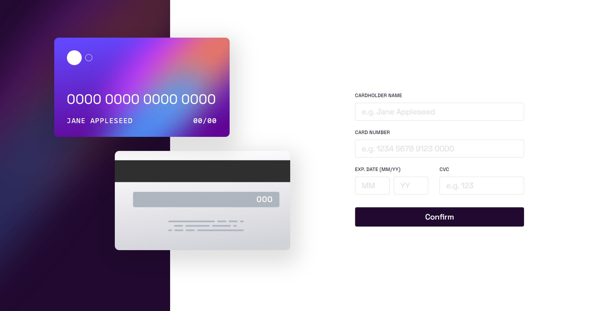

# Frontend Mentor - Interactive card details form solution

This is a solution to the [Interactive card details form challenge on Frontend Mentor](https://www.frontendmentor.io/challenges/interactive-card-details-form-XpS8cKZDWw). Frontend Mentor challenges help you improve your coding skills by building realistic projects.

## Table of contents

- [Frontend Mentor - Interactive card details form solution](#frontend-mentor---interactive-card-details-form-solution)
  - [Table of contents](#table-of-contents)
  - [Overview](#overview)
    - [The challenge](#the-challenge)
    - [Screenshot](#screenshot)
    - [Links](#links)
    - [Built with](#built-with)
    - [What I learned](#what-i-learned)
    - [Useful resources](#useful-resources)
  - [Author](#author)

## Overview

### The challenge

Users should be able to:

- Fill in the form and see the card details update in real-time
- Receive error messages when the form is submitted if:
  - Any input field is empty
  - The card number, expiry date, or CVC fields are in the wrong format
- View the optimal layout depending on their device's screen size
- See hover, active, and focus states for interactive elements on the page

### Screenshot

### Links

- Solution URL: (https://github.com/cameaann/interactiveCard)
- Live Site URL: (https://cameaann.github.io/interactiveCard/)

### Built with

- Semantic HTML5 markup
- CSS custom properties
- Flexbox
- CSS Grid
- Mobile-first workflow
- [React](https://reactjs.org/) - JS library
- React-hook-form
- Input-formatter library React Number Format

### What I learned

I learned how to use useContext hook that lets read and subscribe to context from your component.
Also in this project I created logic that is validated  with the help of my written automatic unit tests.
Learned how to create unit tests.

### Useful resources

- [How to Create Forms in React using react-hook-form](https://www.freecodecamp.org/news/how-to-create-forms-in-react-using-react-hook-form/) - This source introduced me with a very useful react-hook-form library that helps to create flexible and extensible forms with easy-to-use validation.

## Author

- Frontend Mentor - [@cameaann](https://www.frontendmentor.io/profile/cameaann)
